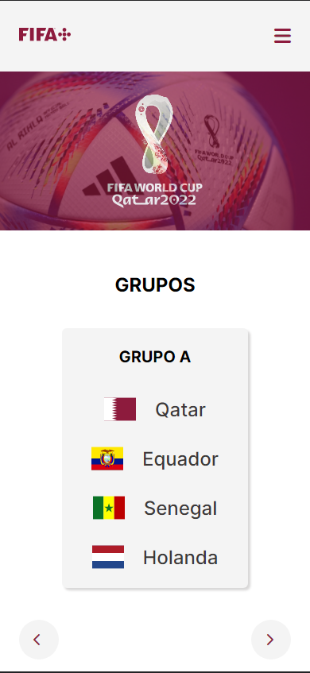
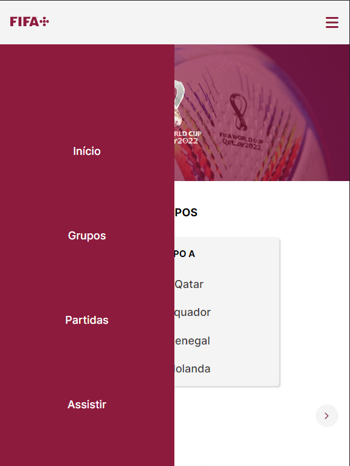

# Copa
- Projeto baseado no desafio da comunidade Codêlandia, onde o objetivo é codar uma página inspirada na copa do mundo. Onde você pode ver os grupos, partidas e as partidas recentes.

## Design 

## Design mobile

## Menu mobile 

### Deploy
- Você pode conferir o projeto pelo link: https://copa-brown.vercel.app/
